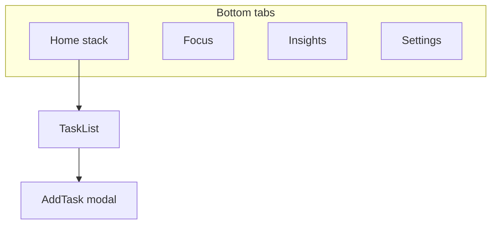
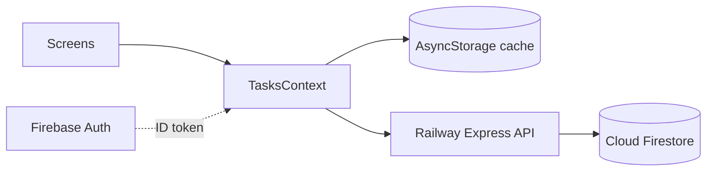
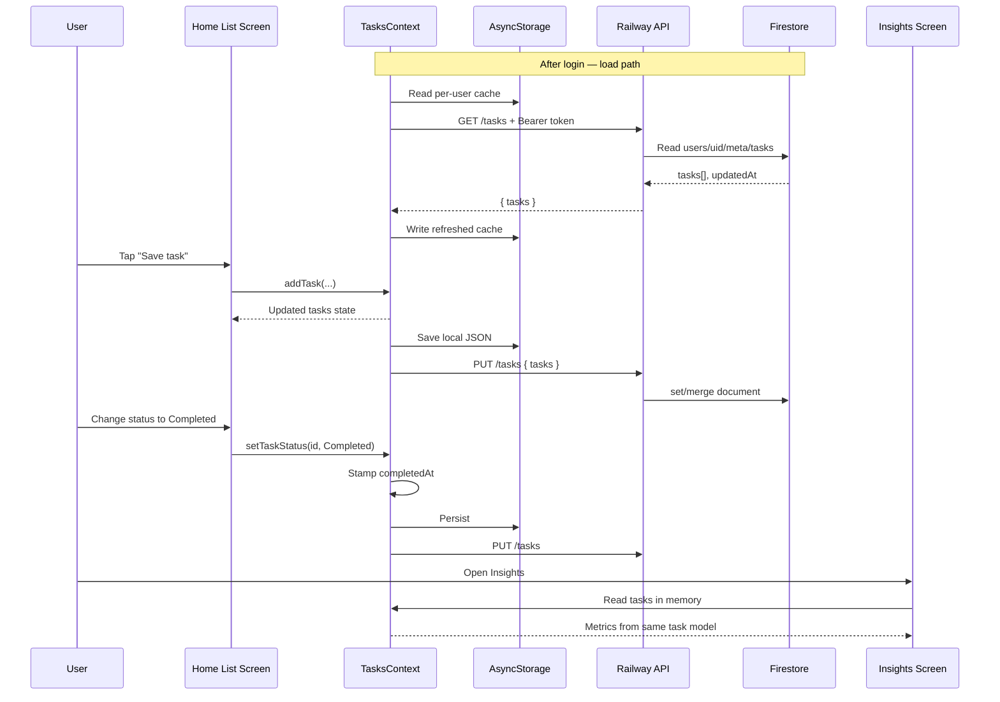

# Mobile App Project Report

**Altınbaş University — Department of Software Engineering**  
**Course:** Introduction to Mobile Application Development  
**Instructor:** F. Kuzey Edes Huyal  
**Due date:** 29 April 2026  
**Platform:** React Native (Expo)

---

**Student name and surname:** *[Fill in]*  
**Student number:** *[Fill in]*  
**GitHub username:** *[Fill in]*  
**Repository URL:** *[Paste your public GitHub repository link]*  

**Declaration:** I confirm that this project was completed individually, that the report reflects my own understanding and work, and that I have not shared or copied another student’s submission.  

**Signature:** _________________________  **Date:** ___________

---

## 1. Introduction

This report describes **Smart Task Planner**, a **React Native (Expo)** app for tasks with **categories**, **priorities**, **statuses**, **local cache (AsyncStorage)**, optional **cloud sync** after sign-in, a **25/5 Pomodoro** timer, **Insights**, and **Settings** (theme, profile, clear data). Early iterations stored tasks only on-device; the current version adds **Firebase Authentication**, **Cloud Firestore** (via a small **Node/Express** API), and **Railway** hosting so each user’s tasks can persist in the cloud while still being cached on the phone. Insert **screenshots** in §6 and **sign** the printed copy.

---

## 2. Project Idea

The app is a **task planner** (not only a flat list): Study / Work / Health / Personal categories; **Pending / Active / Done** statuses; **High / Medium / Low** priorities; **search and filters**; **Insights** (completion mix + weekly count using `completedAt`); **Focus** (work/break + alerts, work tied to one **Active** task); **Settings** (dark/light theme, display name, delete all tasks).

---

## 3. Technology Choice

**Stack:** **React Native** + **Expo (SDK 54)** + **TypeScript**.

**Why React Native instead of Kotlin-only:** One **TypeScript** codebase runs on **Android and iOS** via Expo. The same screens cover navigation, forms, lists, and storage—less duplicate UI work than maintaining separate native apps for the same coursework features.

**Why not Flutter:** Flutter is valid; here the priority was **React hooks + Context** (familiar from web-style courses) and Expo’s quick **Expo Go** testing loop.

**Why Expo:** Managed SDK, easy device demos, and modules used in the project (`AsyncStorage`, `react-native-svg`, `expo-haptics`, React Navigation) without custom native linking for this scope.

**Libraries ↔ rubric:** React Navigation (tabs + stack modal), AsyncStorage (device cache + theme/profile when not using cloud for those), **Firebase** (modular `firebase/auth` client), themed `StyleSheet` + `ThemeContext`, SVG rings on Insights.

**Cloud stack (current submission):** **Firebase Auth** (email/password) on the app; **Firebase Admin SDK** on the backend verifies **Bearer ID tokens** and accesses **Cloud Firestore**. The API is an **Express** service deployed on **Railway**; the mobile app points to it with `EXPO_PUBLIC_API_BASE_URL`. Tasks are stored in Firestore as a single document per user (see §4.1); the app mirrors that JSON in AsyncStorage under a **per-user key** for resilience when the network is down.

---

## 4. Planning Stage

| Tab | Role |
|-----|------|
| **Home** | List, search, filters, priority groups, FAB → stack **modal** “New task”. |
| **Focus** | Pomodoro **work / break**, `useEffect` + `setInterval`, `Alert` on end; work uses one **Active** task. |
| **Insights** | Ratios + weekly completions from the in-memory `tasks` array (same logical model as Firestore + local cache). |
| **Settings** | Theme toggle (persisted), profile JSON, clear all tasks. |

**Task fields (TypeScript `Task`):** `id` (string), `title` (string), `category` (`Study` \| `Work` \| `Health` \| `Personal`), `status` (`Pending` \| `InProgress` \| `Completed`), `priority` (`High` \| `Medium` \| `Low`), `createdAt` (number, epoch ms), optional `completedAt` (number) when status is **Completed** (used for weekly stats). Optional legacy/extra fields in the type (`description`, `startTime`) are normalised by `migrateTasks.ts` when loading old JSON.

**Storage:** **Signed-in users:** tasks load from **GET `/tasks`** (then overwrite local cache `smart_task_planner_tasks_v2_<uid>`); changes trigger **PUT `/tasks`** with `{ tasks }` plus `Authorization: Bearer <Firebase ID token>`. **Not signed in:** tasks still persist to the global key `smart_task_planner_tasks_v2` on change (list starts empty until the user adds tasks). **Theme** and **profile** remain **AsyncStorage** keys separate from Firestore in this scope.

### 4.1 Backend, Firebase, Railway, and Firestore shape

| Layer | Role |
|-------|------|
| **Expo app** | Firebase client **Auth**; `fetch` to Railway base URL for tasks. |
| **Railway** | Hosts **Express** (`backend/`), listens on `PORT`, CORS + JSON body. |
| **Firebase Admin** | Loads **service account JSON** from env `FIREBASE_SERVICE_ACCOUNT_JSON`; verifies ID tokens; uses **Firestore**. |
| **Firestore path** | Collection `users` → document `{userId}` → subcollection `meta` → document `tasks`. |
| **Document fields** | `tasks`: **array** of task objects (same shape as the app’s `Task[]` after normalisation); `updatedAt`: **number** (server write timestamp, ms). |

**API summary:** `GET /tasks` returns `{ tasks: Task[] }` (empty array if no doc). `PUT /tasks` accepts `{ tasks: Task[] }` and **set**s/merges the document above. All task routes require a valid **Firebase ID token** in the header.

---

#### ملخص عربي (للمراجعة والواجب)

- **قبل:** المهام تُحفظ محلياً فقط (AsyncStorage) مثل «جلسة» على الجهاز.  
- **الآن:** بعد **تسجيل الدخول** تُرفع المهام إلى **Firebase** عبر واجهة برمجية على **Railway**؛ المصادقة **Firebase Auth** (إيميل/كلمة مرور)، والبيانات في **Cloud Firestore** تحت المسار أعلاه.  
- **نوع البيانات:** مصفوفة مهام `tasks`؛ كل مهمة تحتوي حقولاً نصية وأعداداً كما في الجدول أعلاه؛ `completedAt` رقم (وقت الإنجاز) للإحصائيات الأسبوعية.  
- **التخزين المزدوج:** السحابة هي المصدر عند نجاح الشبكة، مع **نسخة محلية** لكل مستخدم لتقليل فقدان البيانات عند انقطاع الاتصال.

**Navigation (Mermaid — [mermaid.live](https://mermaid.live)):**



**Data flow:**



**Task lifecycle interaction (UML Sequence Diagram):**



---

## 5. Development Stage

**Setup:** Code in `mobile/`; root tree `SafeAreaProvider` → `ThemeProvider` → `TasksProvider` → navigator.

**Navigation:** Bottom tabs; **Home** wraps a **native stack** (`TaskList`, modal `AddTask`, `goBack`).

**UI:** `useTheme().colors`; cards with chips, FAB, empty / no-results states.

**Logic:** CRUD with trimmed title validation; **one Active** task for Focus; Pomodoro phases; Insights `useMemo`; Settings `Switch` + destructive clear.

**Data:** On **login**, load local cache for that `uid`, then **GET /tasks**; merge/normalise with `migrateTasks.ts`; after `hydrated`, each `tasks` change saves to **AsyncStorage** (per user) and **PUT /tasks** to Firestore via Railway. If the user is **logged out**, the older single-device path still writes the global v2 key. `completedAt` on completion feeds weekly stats. Theme and profile continue to use AsyncStorage only.

### 5.3 Final account/data behavior

In the final version, two key requirements were ensured:

- **Login persistence:** after a user signs in, the session remains available after closing and reopening the app, so the user does not need to log in every time.
- **Per-user task storage:** task data is saved per authenticated user account (by user UID), so each user sees only their own tasks across devices when using the same account.

**Folders:** `context/`, `theme/`, `navigation/`, `screens/`, `components/`, `utils/`.

### 5.1 Code discussion (short fragments — rewrite explanations in your own words)

**(A) Load vs save — two effects**

```typescript
useEffect(() => {
  let cancelled = false;
  setHydrated(false);
  const load = async () => {
    if (!user) {
      setTasks([]);
      setHydrated(true);
      return;
    }
    const local = await loadTasksForUser(user.uid);
    if (!cancelled) setTasks(local);
    // then GET /tasks + Bearer token; if ok, replace state + cache
    // finally: if (!cancelled) setHydrated(true)
  };
  void load();
  return () => { cancelled = true; };
}, [user]);

useEffect(() => {
  if (!hydrated) return;
  if (!user) {
    saveTasksToStorage(tasks);
    return;
  }
  // save per-user AsyncStorage + PUT /tasks
}, [tasks, hydrated, user]);
```

**Point:** Async load uses a **cancel** flag and depends on **`user`** (auth session). Saves run only **after** hydration so an empty list is not synced before the first server/local read finishes.

**(B) One Active task**

```typescript
if (status === 'InProgress') {
  return prev.map((task) => {
    if (task.id === id) return applyStatusPatch(task, 'InProgress');
    if (task.status === 'InProgress')
      return { ...task, status: 'Pending', completedAt: undefined };
    return task;
  });
}
```

**Point:** Business rule lives in **context**: only one `InProgress`; others return to `Pending`. `applyStatusPatch` sets `completedAt` when status becomes `Completed` (feeds Insights).

**(C) Timer effect + cleanup**

```typescript
useEffect(() => {
  if (!isActive) {
    if (intervalRef.current) clearInterval(intervalRef.current);
    return;
  }
  intervalRef.current = setInterval(() => setSeconds((s) => Math.max(0, s - 1)), 1000);
  return () => {
    if (intervalRef.current) clearInterval(intervalRef.current);
  };
}, [isActive]);
```

**Point:** Interval is **tied to the effect** and cleared on pause/unmount — matches “handling timers” coursework. A separate effect handles `seconds === 0` and `Alert` (see `FocusScreen.tsx`).

### 5.2 Testing and validation process

To make the final version reliable, I executed a repeated manual test cycle after each major feature update. I did not use automated unit tests in this assignment scope, so I focused on traceable scenario-based checks that reflect the rubric criteria.

**Functional scenarios:**

1. **Create task validation:** attempt saving with blank title (must fail), then with a valid title (must appear immediately in Home).  
2. **Status workflow:** Pending → Active → Done transitions, including restoring Done back to Pending.  
3. **Single Active rule:** mark one task Active, then mark another task Active and confirm the first returns to Pending.  
4. **Persistence check:** close/reload app and verify tasks, status values, profile name, and theme mode remain stored.  
5. **Search/filter behavior:** search by title, clear search, apply each status filter, and verify list content updates correctly.  
6. **Focus behavior:** start/pause/resume timer, reach zero, verify alert appears, and ensure phase switching (work/break) behaves correctly.  
7. **Insights consistency:** compare counts in Home with Insights metrics (total/completed/open).  

**Technical checks used before finalising:**

- Re-run TypeScript check (`npx tsc --noEmit`) after structural edits.  
- Verify navigation path for all tabs and modal back flow.  
- Confirm destructive action in Settings uses confirmation (`Alert`) before deleting all tasks.  
- Test dark mode readability manually on all main tabs to avoid low-contrast text.
- Re-test account session after force-closing the app to confirm user state is restored without manual login.
- Re-test with two different accounts to confirm each account sees only its own tasks.

This lightweight process was enough for an introductory project and gave confidence that the app does not only “look correct” but also preserves data and state transitions correctly.

---

## 6. Final Version

Delivered: four tabs, search/filters, add-task modal, Pomodoro, Insights rings, Settings (theme + clear), TypeScript, GitHub-ready tree.

### Screenshots (insert before printing)

1. Home — list, search, filters, FAB.  
2. Add task — categories + priorities.  
3. Focus — work timer + Active title.  
4. Insights — rings + weekly line.  
5. Settings — dark toggle (optional: dark Home).

---

## 7. Challenges and Solutions

- **Legacy JSON migration:** Early versions used a different task shape. The risk was losing user data after schema changes. The solution was to normalise records in `migrateTasks.ts` whenever JSON is read from cache or the API. This way, old values are mapped into the new status/category model safely.
- **Timer and task state interaction:** When a work phase ends, the Active task is completed at nearly the same moment the timer state updates. This created race-condition-like behaviour during development. I resolved it by using refs to guard completion transitions and by keeping interval ownership inside one effect with cleanup.
- **Theme refactor scope:** The project initially used static colour imports in several components. Switching to dark mode required moving screens/components to `useTheme().colors` and memoized styles. The challenge was consistency; the result is a single source for visual tokens.
- **Analytics reliability:** Weekly stats depend on `completedAt`. Older tasks without this timestamp can reduce historical precision. I handled this transparently by documenting the limitation and keeping the calculation logic explicit.
- **Per-user data separation:** The challenge was ensuring that tasks never mix between accounts. I solved this by using authenticated user identity (`uid`) in data load/save paths.
- **Auth session continuity:** The challenge was to keep users signed in after app restart. I solved it by enabling persistent auth behavior in the app lifecycle.

---

## 8. Conclusion

The app covers navigation, CRUD, **FlatList** layout helpers, **AsyncStorage** (cache + preferences), **Firebase Auth**, a **hosted REST API** on **Railway** backed by **Firestore**, **Context** theming, timers, and simple analytics—appropriate for an intro mobile course. Trade-off: tasks are stored as **one Firestore document per user** (simple for coursework; very large lists would need chunking or subcollections). Weekly stats still depend on **`completedAt`** being set when tasks complete.

From a learning perspective, the most important gain was understanding how UI interaction, state updates, and persistence are connected in a mobile app lifecycle. Building the Focus and Insights features also improved my confidence in writing logic that depends on time and derived values, not only simple form input/output.

If this project is extended in future iterations, the next improvements would be push/local notifications for timer completion in background mode, richer conflict handling if the same account edits from two devices offline, and more detailed productivity analytics (for example weekly category trends). These are intentionally left as future work so that the current submission remains focused, stable, and aligned with the assignment scope.

---

## 9. GitHub Information

- **Username:** *[Fill in]*  
- **Repository:** *[URL]*  
- **Branch:** *[e.g. main]*  
- **Run:** `cd mobile` → `npm install` → `npx expo start` → Expo Go / emulator.

---

## Appendix — Rubric mapping

| Criterion | Where covered |
|-----------|----------------|
| Idea (10) | §2 |
| Technology (10) | §3 |
| Planning / design (10) | §4–5 |
| UI (15) | §5 |
| Functionality (15) | §2, §5 |
| Navigation (10) | §4–5 |
| Data handling (10) | §4–5 (AsyncStorage, Firestore doc shape, API sync, migration, `completedAt`) |
| Code organisation (10) | §5 folders + §5.1 fragments |
| Report / screenshots (5) | §6 + your edits |
| GitHub (5) | §9 |

---

*Sign the printed report and the departmental list. Keep total text roughly **1000–2000 words** including your added reflection and screenshot captions.*
