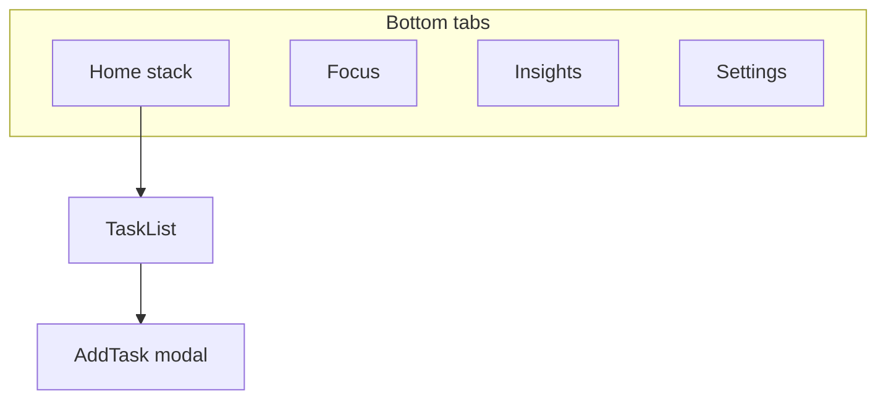
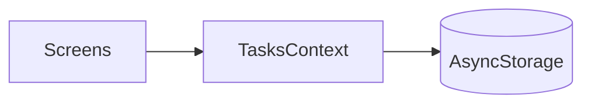
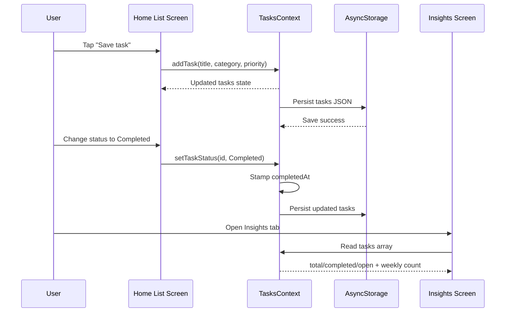

# Mobile App Project Report

**Altınbaş University — Department of Software Engineering**  
**Course:** Introduction to Mobile Application Development  
**Instructor:** F. Kuzey Edes Huyal  
**Due date:** 29 April 2026  
**Platform:** React Native (Expo)

---

**Student name and surname:** *[Fill in]*  
**Student number:** *[Fill in]*  
**GitHub username:** *[Fill in]*  
**Repository URL:** *[Paste your public GitHub repository link]*  

**Declaration:** I confirm that this project was completed individually, that the report reflects my own understanding and work, and that I have not shared or copied another student’s submission.  

**Signature:** _________________________  **Date:** ___________

---

## 1. Introduction

This report describes **Smart Task Planner**, a **React Native (Expo)** app for tasks with **categories**, **priorities**, **statuses**, **offline storage**, a **25/5 Pomodoro** timer, **Insights**, and **Settings** (theme, profile, clear data). Insert **screenshots** in §6 and **sign** the printed copy.

---

## 2. Project Idea

The app is a **task planner** (not only a flat list): Study / Work / Health / Personal categories; **Pending / Active / Done** statuses; **High / Medium / Low** priorities; **search and filters**; **Insights** (completion mix + weekly count using `completedAt`); **Focus** (work/break + alerts, work tied to one **Active** task); **Settings** (dark/light theme, display name, delete all tasks).

---

## 3. Technology Choice

**Stack:** **React Native** + **Expo (SDK 54)** + **TypeScript**.

**Why React Native instead of Kotlin-only:** One **TypeScript** codebase runs on **Android and iOS** via Expo. The same screens cover navigation, forms, lists, and storage—less duplicate UI work than maintaining separate native apps for the same coursework features.

**Why not Flutter:** Flutter is valid; here the priority was **React hooks + Context** (familiar from web-style courses) and Expo’s quick **Expo Go** testing loop.

**Why Expo:** Managed SDK, easy device demos, and modules used in the project (`AsyncStorage`, `react-native-svg`, `expo-haptics`, React Navigation) without custom native linking for this scope.

**Libraries ↔ rubric:** React Navigation (tabs + stack modal), AsyncStorage (offline JSON), themed `StyleSheet` + `ThemeContext`, SVG rings on Insights.

---

## 4. Planning Stage

| Tab | Role |
|-----|------|
| **Home** | List, search, filters, priority groups, FAB → stack **modal** “New task”. |
| **Focus** | Pomodoro **work / break**, `useEffect` + `setInterval`, `Alert` on end; work uses one **Active** task. |
| **Insights** | Ratios + weekly completions from the `tasks` array (same data AsyncStorage stores). |
| **Settings** | Theme toggle (persisted), profile JSON, clear all tasks. |

**Task fields:** `id`, `title`, `category`, `status`, `priority`, `createdAt`, optional `completedAt` when completed. **Storage:** tasks `smart_task_planner_tasks_v2` (with legacy migration if needed), plus keys for theme and profile.

**Navigation (Mermaid — [mermaid.live](https://mermaid.live)):**



**Data flow:**



**Task lifecycle interaction (UML Sequence Diagram):**



---

## 5. Development Stage

**Setup:** Code in `mobile/`; root tree `SafeAreaProvider` → `ThemeProvider` → `TasksProvider` → navigator.

**Navigation:** Bottom tabs; **Home** wraps a **native stack** (`TaskList`, modal `AddTask`, `goBack`).

**UI:** `useTheme().colors`; cards with chips, FAB, empty / no-results states.

**Logic:** CRUD with trimmed title validation; **one Active** task for Focus; Pomodoro phases; Insights `useMemo`; Settings `Switch` + destructive clear.

**Data:** Load → normalise (`migrateTasks.ts`) → state; after `hydrated`, `useEffect` saves `tasks` to AsyncStorage; `completedAt` on completion for weekly stats.

**Folders:** `context/`, `theme/`, `navigation/`, `screens/`, `components/`, `utils/`.

### 5.1 Code discussion (short fragments — rewrite explanations in your own words)

**(A) Load vs save — two effects**

```typescript
useEffect(() => {
  let cancelled = false;
  loadTasksFromStorage().then((loaded) => {
    if (!cancelled) { setTasks(loaded); setHydrated(true); }
  });
  return () => { cancelled = true; };
}, []);

useEffect(() => {
  if (!hydrated) return;
  saveTasksToStorage(tasks);
}, [tasks, hydrated]);
```

**Point:** Async load uses a **cancel** flag; saves run only **after** hydration so an empty list is not written before data arrives.

**(B) One Active task**

```typescript
if (status === 'InProgress') {
  return prev.map((task) => {
    if (task.id === id) return applyStatusPatch(task, 'InProgress');
    if (task.status === 'InProgress')
      return { ...task, status: 'Pending', completedAt: undefined };
    return task;
  });
}
```

**Point:** Business rule lives in **context**: only one `InProgress`; others return to `Pending`. `applyStatusPatch` sets `completedAt` when status becomes `Completed` (feeds Insights).

**(C) Timer effect + cleanup**

```typescript
useEffect(() => {
  if (!isActive) {
    if (intervalRef.current) clearInterval(intervalRef.current);
    return;
  }
  intervalRef.current = setInterval(() => setSeconds((s) => Math.max(0, s - 1)), 1000);
  return () => {
    if (intervalRef.current) clearInterval(intervalRef.current);
  };
}, [isActive]);
```

**Point:** Interval is **tied to the effect** and cleared on pause/unmount — matches “handling timers” coursework. A separate effect handles `seconds === 0` and `Alert` (see `FocusScreen.tsx`).

### 5.2 Testing and validation process

To make the final version reliable, I executed a repeated manual test cycle after each major feature update. I did not use automated unit tests in this assignment scope, so I focused on traceable scenario-based checks that reflect the rubric criteria.

**Functional scenarios:**

1. **Create task validation:** attempt saving with blank title (must fail), then with a valid title (must appear immediately in Home).  
2. **Status workflow:** Pending → Active → Done transitions, including restoring Done back to Pending.  
3. **Single Active rule:** mark one task Active, then mark another task Active and confirm the first returns to Pending.  
4. **Persistence check:** close/reload app and verify tasks, status values, profile name, and theme mode remain stored.  
5. **Search/filter behavior:** search by title, clear search, apply each status filter, and verify list content updates correctly.  
6. **Focus behavior:** start/pause/resume timer, reach zero, verify alert appears, and ensure phase switching (work/break) behaves correctly.  
7. **Insights consistency:** compare counts in Home with Insights metrics (total/completed/open).  

**Technical checks used before finalising:**

- Re-run TypeScript check (`npx tsc --noEmit`) after structural edits.  
- Verify navigation path for all tabs and modal back flow.  
- Confirm destructive action in Settings uses confirmation (`Alert`) before deleting all tasks.  
- Test dark mode readability manually on all main tabs to avoid low-contrast text.

This lightweight process was enough for an introductory project and gave confidence that the app does not only “look correct” but also preserves data and state transitions correctly.

---

## 6. Final Version

Delivered: four tabs, search/filters, add-task modal, Pomodoro, Insights rings, Settings (theme + clear), TypeScript, GitHub-ready tree.

### Screenshots (insert before printing)

1. Home — list, search, filters, FAB.  
2. Add task — categories + priorities.  
3. Focus — work timer + Active title.  
4. Insights — rings + weekly line.  
5. Settings — dark toggle (optional: dark Home).

---

## 7. Challenges and Solutions

- **Legacy JSON migration:** Early versions used a different task shape. The risk was losing user data after schema changes. The solution was to normalise records in `migrateTasks.ts` and keep a v2 storage key. This way, old values are mapped into the new status/category model safely.
- **Timer and task state interaction:** When a work phase ends, the Active task is completed at nearly the same moment the timer state updates. This created race-condition-like behaviour during development. I resolved it by using refs to guard completion transitions and by keeping interval ownership inside one effect with cleanup.
- **Theme refactor scope:** The project initially used static colour imports in several components. Switching to dark mode required moving screens/components to `useTheme().colors` and memoized styles. The challenge was consistency; the result is a single source for visual tokens.
- **Analytics reliability:** Weekly stats depend on `completedAt`. Older tasks without this timestamp can reduce historical precision. I handled this transparently by documenting the limitation and keeping the calculation logic explicit.

---

## 8. Conclusion

The app covers navigation, CRUD, **FlatList** layout helpers, **AsyncStorage**, **Context** theming, timers, and simple analytics—appropriate for an intro mobile course. Trade-off: no cloud sync; weekly stats need `completedAt`.

From a learning perspective, the most important gain was understanding how UI interaction, state updates, and persistence are connected in a mobile app lifecycle. Building the Focus and Insights features also improved my confidence in writing logic that depends on time and derived values, not only simple form input/output.

If this project is extended in future iterations, the next improvements would be push/local notifications for timer completion in background mode, optional cloud sync for multi-device continuity, and more detailed productivity analytics (for example weekly category trends). These are intentionally left as future work so that the current submission remains focused, stable, and aligned with the assignment scope.

---

## 9. GitHub Information

- **Username:** *[Fill in]*  
- **Repository:** *[URL]*  
- **Branch:** *[e.g. main]*  
- **Run:** `cd mobile` → `npm install` → `npx expo start` → Expo Go / emulator.

---

## Appendix — Rubric mapping

| Criterion | Where covered |
|-----------|----------------|
| Idea (10) | §2 |
| Technology (10) | §3 |
| Planning / design (10) | §4–5 |
| UI (15) | §5 |
| Functionality (15) | §2, §5 |
| Navigation (10) | §4–5 |
| Data handling (10) | §5 (storage, migration, `completedAt`) |
| Code organisation (10) | §5 folders + §5.1 fragments |
| Report / screenshots (5) | §6 + your edits |
| GitHub (5) | §9 |

---

*Sign the printed report and the departmental list. Keep total text roughly **1000–2000 words** including your added reflection and screenshot captions.*
